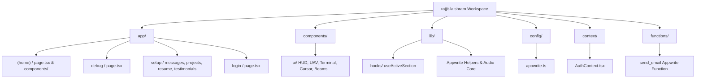

# Rajjit Laishram - Codebase Architecture & Systems Review

This document provides a highly detailed analysis of the **Rajjit Laishram - IoT Software Developer Portfolio** codebase. It outlines the technology stack, application structure, custom real-time visual and audio synthesis mechanics, administrative control portals, and core functional logic.

---

## 🛰️ 1. Technical Stack Overview

The application is built as a high-density, performance-optimized, and premium developer portfolio with an immersive **cyberpunk heads-up display (HUD)** design.

| Component Layer | Technology | Details |
| :--- | :--- | :--- |
| Core Framework | Next.js 15.x (App Router) | Utilizing React 19.0.0, TypeScript, and Server/Client Component splitting. |
| **Styling & UI** | Tailwind CSS `^3.4.1` | Tailored with sleek HSL colors, neon drop shadows, glassmorphism layers, and custom webkit scrollbars. (Migration to v4 pending) |
| **Animations** | Framer Motion `motion ^12.5.0` | Custom UI micro-animations, transitions, and hardware-accelerated movement. |
| **Backend / DB** | Appwrite Core | Configured with `appwrite` (Client SDK) and `node-appwrite` (Server SDK) for handling database collections and file storage buckets. |
| **Deployment** | Netlify | Managed through `netlify.toml` leveraging `@netlify/plugin-nextjs`. |
| **Comms / Comps** | Custom Synthesized Web Audio | Real-time audio waveform feedback built directly using the browser's native Web Audio API (no heavy MP3 downloads). |

---

## 🗂️ 2. Workspace & Routing Structure

The codebase is organized cleanly to separate shared layout structures, developer test suites, administration views, utility scripts, and contexts.



### Key Directories Explained:
*   [app/](file:///d:/2026/rajjit-laishram/app): Contains the Next.js App Router structure.
    *   [(home)](file:///d:/2026/rajjit-laishram/app/(home)): Main landing page (using Server-Side Rendering to initially fetch projects and client-side hydration for dynamic animations).
    *   [debug/](file:///d:/2026/rajjit-laishram/app/debug): Isolated playground that allows developers to check env state and load/render all visual blocks instantly for testing.
    *   [setup/](file:///d:/2026/rajjit-laishram/app/setup): Complete administrative suite where authenticated administrators can modify database items, view submissions, and upload resume files.
    *   [login/](file:///d:/2026/rajjit-laishram/app/login): Admin authentication portal.
*   [components/ui/](file:///d:/2026/rajjit-laishram/components/ui): Houses custom UI assets, neon design features, and specialized interactives (e.g., custom cursor, scrolling logs, and particle grids).
*   [lib/](file:///d:/2026/rajjit-laishram/lib): Contains shared database utility helper functions (`createProject.ts`, `getMessages.ts`, etc.) and system parameters.
*   [context/](file:///d:/2026/rajjit-laishram/context): Holds the client auth provider (`AuthContext.tsx`) which wraps the dashboard pages.
*   [functions/send_email/](file:///d:/2026/rajjit-laishram/functions/send_email): An Appwrite cloud function using Node.js and `nodemailer` that sends SMTP admin emails whenever contact forms are submitted or reviews are created.

---

## 🎛️ 3. Appwrite Database & File Storage Architecture

The application interfaces directly with Appwrite database collections and file storage buckets via parameters configured in [config/appwrite.ts](file:///d:/2026/rajjit-laishram/config/appwrite.ts).

### Database Collections:
1.  **Projects Collection (`projectCollectionsId`)**: Contains details of portfolio items (`title`, `summary`, `problem`, `solution`, `role`, `impact`, `project_image_url`, `project_link`, `tech_stack`, `isArchived`, `signals`, and `createdAt`).
2.  **Messages Collection (`messagesCollectionsId`)**: Stores incoming contact submissions (`name`, `email`, `message`, and timestamp).
3.  **Testimonials Collection (`testimonialCollectionsId`)**: Stores developer recommendations and ratings (`name`, `description`, `rating`, `role`, `profile_image_url`, and approval statuses).

### Storage Buckets:
1.  **Profile Images Bucket (`profileImagesBucketId`)**: Stores uploaded images for testimonials.
2.  **Resume Bucket (`resumeBucketId`)**: Stores the developer's downloadable CV file (`resumeFileId`).

> [!NOTE]
> Signups are globally disabled within the Appwrite console instance. Because there is exactly one legitimate system owner, any successfully authenticated user via `account.createEmailPasswordSession()` in [context/AuthContext.tsx](file:///d:/2026/rajjit-laishram/context/AuthContext.tsx) is automatically granted Admin rights (`isAdmin = true`) to view and modify the setup collections.

---

## 🎹 4. Custom Real-Time Synthesized Audio Core

Rather than loading bloated `.mp3` files that drag down SEO, page speeds, and mobile performance, this portfolio employs an optimized browser-synthesized audio framework in [lib/audio.ts](file:///d:/2026/rajjit-laishram/lib/audio.ts) using the native **Web Audio API**.

```javascript
class AudioSystem {
    private ctx: AudioContext | null = null;
    private isMuted: boolean = true;

    playClick() {
        if (this.isMuted) return;
        this.init();
        if (!this.ctx) return;

        const osc = this.ctx.createOscillator();
        const gain = this.ctx.createGain();

        osc.type = "sine";
        osc.frequency.setValueAtTime(1200, this.ctx.currentTime);
        osc.frequency.exponentialRampToValueAtTime(0.01, this.ctx.currentTime + 0.1);

        gain.gain.setValueAtTime(0.05, this.ctx.currentTime);
        gain.gain.exponentialRampToValueAtTime(0.01, this.ctx.currentTime + 0.1);

        osc.connect(gain);
        gain.connect(this.ctx.destination);

        osc.start();
        osc.stop(this.ctx.currentTime + 0.1);
    }
    // ... Additional oscillators for hover scans (playDataScan) and boots (playPowerUp)
}
```

*   **Sine Oscillators**: Used for click reactions, creating crisp, exponential high-frequency blips.
*   **Square Oscillators**: Used for link hover scans, creating short high-speed sweep waves that feel like reading data packets.
*   **Sawtooth Oscillators**: Used for system launches or drone humming simulations to represent motorized components.

---

## 🛸 5. Tactical UAV Flight Simulation Mechanics

The crowning interactive element is the fully synthesized **UAV Drone Simulation** found in [components/ui/UAVSimulation.tsx](file:///d:/2026/rajjit-laishram/components/ui/UAVSimulation.tsx). 

```mermaid
sequenceDiagram
    participant U as User / Auto Pilot
    participant S as Simulation Engine (RAF/Interval)
    participant A as Web Audio API
    participant D as DOM (Refs)
    participant T as SystemToaster

    U->>S: Engage Auto / WASD Manual
    rect rgb(10, 10, 10)
        note right of S: 60FPS Update Loop
        S->>A: playDroneHum(freq = base + delta, volume)
        S->>D: Direct DOM Position Style (avoid React redraws)
        S->>S: TCAS Proximity Check (Distance Calculation)
    end
    S->>T: Dispatch Alert Signals (Proximity Warning / Complete)
```



### Core Flight Features:
1.  **Double Drone Operations**:
    *   **ACE Unit (Surveyor - Blue)**: Runs an automated, stateful lawnmower grid mapping sweeping pattern across the viewport coordinate system. As it sweeps, it periodically drops navigation waypoints.
    *   **INF Unit (Validator - Green)**: Dynamically calculates mathematical target tracking grids, pursuing pending waypoints dropped by ACE and validating sections one by one.
2.  **Performance Optimization**: To prevent high-frequency frame drops and input lag, coordinates and trails are written directly to DOM element `style.left`, `style.top`, and SVG `<polyline>` attributes using React `useRef` handles, completely skipping heavy React render cascades.
3.  **Real-Time synthesized Drone Motor Hums**: Synthesizes deep humming frequencies in real-time, pitching up when accelerating vertically, using active oscillators.
4.  **TCAS Proximity Collision Warning**: Dynamically computes Euclidean distances between units:
    $$\text{Distance} = \sqrt{(x_{\text{ACE}} - x_{\text{INF}})^2 + (y_{\text{ACE}} - y_{\text{INF}})^2}$$
    If distance drops below 10%, a warning is flashed. If below 5%, proximity alert warning signals are dispatched to [SystemToaster.tsx](file:///d:/2026/rajjit-laishram/components/ui/SystemToaster.tsx).
5.  **Interactive Controls**: Supports a manual steering mode where users can pilot both drones concurrently using `W/A/S/D` (ACE) and `I/J/K/L` (INF) keys on physical keyboards, or layout d-pads on mobile interfaces.

---

## 💬 6. Interactive Command CLI & Local Chatbot Subsystems

In addition to the visual layout, the portfolio integrates an interactive terminal prompt [components/ui/Terminal.tsx](file:///d:/2026/rajjit-laishram/components/ui/Terminal.tsx) representing a terminal chatbot named **ACE (Automated Conversational Entity)**.

### Subsystem Features:
*   **System CLI Protocols**: Allows executing direct CLI actions:
    *   `/neofetch`: Renders custom system hardware/kernel information.
    *   `/sim` / `/drone`: Directly initializes and triggers the UAV Flight Simulation workspace modal.
    *   `/uav [patrol|scan|return|stealth]`: Communicates via custom events to control flying drone nodes in [DroneOverlay.tsx](file:///d:/2026/rajjit-laishram/components/ui/DroneOverlay.tsx) gliding behind the website viewports.
    *   `/resume`: Extracts the CV asset from Appwrite.
    *   `/init`, `/metrics`, `/arsenal`, `/missions`, `/chronicles`, `/feedback`, `/uplink`: Command routes that smoothly scroll the window viewport to the corresponding content section.
*   **Localized Conversational Assistant**: Parses plain English queries about Rajjit's background, bio, skills, and portfolio using a local search matching algorithm tied to [lib/data.json](file:///d:/2026/rajjit-laishram/lib/data.json).
*   **Aesthetic Shortcuts**: Supports command buttons beneath the console input for fast tapping on touchscreens, and toggle hooks mapped to backtick `` ` `` and `Ctrl+K`.

---

## 🎨 7. Aesthetic HUD Components

Every component on the homepage contributes to the overarching cybernetic telemetry atmosphere:

*   [ViewportHUD.tsx](file:///d:/2026/rajjit-laishram/components/ui/ViewportHUD.tsx): Frames the viewport with high-tech HUD elements. Tracks exact mouse coordinates in real-time, displays scroll progress percentages, tracks live system bandwidth metrics, and dynamically extracts current active protocol markers (e.g. `TIMELINE_RECORD_EST`) using an active Intersection Observer hook [useActiveSection.ts](file:///d:/2026/rajjit-laishram/lib/hooks/useActiveSection.ts).
*   [HUDIndex.tsx](file:///d:/2026/rajjit-laishram/components/ui/HUDIndex.tsx): Interactive side index that shows smooth layout animations, allowing clicking to glide between protocols.
*   [CustomCursor.tsx](file:///d:/2026/rajjit-laishram/components/ui/CustomCursor.tsx): Eliminates the standard OS cursor on desktop devices, replacing it with a target bracket that rotates, expands, and shows customized coordinate locks when hovering over active nodes.
*   [LogicFlux.tsx](file:///d:/2026/rajjit-laishram/components/ui/LogicFlux.tsx): Renders lightweight animated cybernetic grid pathways carrying moving particle packets of green/cyan light with glowing drop-shadows.
*   [AtmosphericPulse.tsx](file:///d:/2026/rajjit-laishram/components/ui/AtmosphericPulse.tsx): mouse-tracking grid ripples that emit expanding circular light waves.
*   [SystemLog.tsx](file:///d:/2026/rajjit-laishram/components/ui/SystemLog.tsx): Animated footer marquee that actively appends global cursor clicks and viewport offset changes, creating a constant sense of data transmission.
*   [SystemToaster.tsx](file:///d:/2026/rajjit-laishram/components/ui/SystemToaster.tsx): Custom floating terminal toast notification cards displaying neon status codes and countdown bars.

---

## 🔍 8. Insights & Key Design Decisions

1.  **React 19 & Next.js 16 Compatibility**: The app is built on cutting-edge releases, utilizing dynamic package streaming and optimized rendering pipelines.
2.  **Meitei Mayek Script Integration**: The HUD sidebar beautifully displays Rajjit's localized name `ꯔꯖ꯭ꯖꯤꯠ ꯂꯥꯏꯁ꯭ꯔꯝ` using the custom Meitei Mayek script font, representing his roots in Imphal East, Manipur. This adds premium, custom localization to the global cyberpunk motif.
3.  **Low Paint Cost Strategies**: Heavy animation loops (e.g., global scanline grids, data fluxes) are engineered using hardware-accelerated CSS and SVGs to avoid high painting costs and preserve battery life on mobile devices.
4.  **Decoupled CLI & Overlay Architecture**: Trigger mechanisms between the terminal chatbot, the background drone overlay, and the telemetry dashboard rely on customized event dispatching. This minimizes tightly coupled React dependencies, keeping sections clean, reusable, and easy to maintain.
